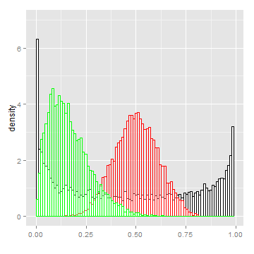
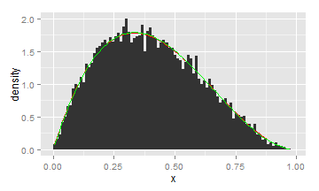

### Beta Distribution Explorer

By RaphT, Feb 2015
<br><br>
<br><br>
<br><br>
Try out the explorer [here](http://rapht.shinyapps.io/DataProductProject/)

--- &twocol

### The Beta Distribution Family

*** =left
The Beta distribution is a family of distributions:
- Continuously defined in the [0,1] interval
- Controlled by two positive shape parameters alpha and beta
- Used to model random variables limited to a finite length interval

*** =right
 

<span style="font-size:0.5em;">Examples of beta distribution</span>

*** =fullwidth
[Beta distributions on Wikipedia](http://en.wikipedia.org/wiki/Beta_distribution)

--- 

### Explorer work flow

1. Simulates a beta distribution based on a set of parameters 
2. Uses **[Betareg](http://cran.r-project.org/web/packages/betareg/vignettes/betareg.pdf)** to fit alpha and beta on the simulated distribution 
3. Displays the distribution and the theoretical and fitted density functions 


```r
alpha = 2; beta = 3; dist = data.frame(x = rbeta(100, alpha, beta))
```

```r
model = betareg(x~., link = "logit", link.phi = "log", data = dist)
```


```r
ggplot(dist, aes(x=x)) + geom_histogram(aes(y=..density..), breaks=seq(0,1,by=0.011))+
  stat_function(fun=dbeta, args=list(shape1=alpha, shape2 = beta),col = "red")+
  stat_function(fun=dbeta, args=list(shape1=alpha.fitted, shape2 = beta.fitted),col = "green")
```

 

--- &twocol

### Explorer Options

*** =left2

Interactively change the value of alpha and beta via sliders
<br><br>
Interactively change the number of samples in the distribution
<br><br>
Choose the standard or alternative parametrization of the distribution

&nbsp;&nbsp;&nbsp;1. The standard directly uses alpha and beta

&nbsp;&nbsp;&nbsp;2. The alternative uses mu (location) and phi (dispersion)

--- 

### Future work

Add the possibility to open and fit custom data set
<br><br>
<br><br>
<br><br>

### Acknowledgments

This [webpage](http://zevross.com/blog/2014/11/19/creating-elegant-html-presentations-that-feature-r-code/) helped me get the two columns to work

